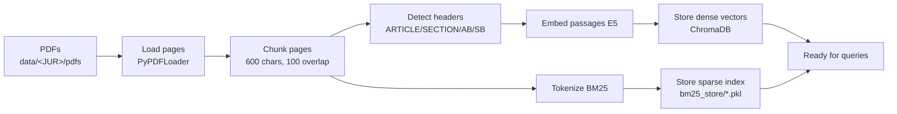

# RegNavigator — Technical Documentation

> Deep-dive docs: architecture, data corpus, code map, and design notes.
> For a quick overview and quickstart, see the [project README](../README.md).

## Executive Summary

- **Purpose:** Answer regulatory questions with grounded citations from your own PDF corpora (bills, statutes, guidance).
- **Approach:** Retrieval-Augmented Generation (RAG) with hybrid retrieval (dense vectors + BM25), cross-encoder reranking, and an LLM that answers strictly from retrieved snippets.
- **Deliverables:** FastAPI backend, Tailwind single-page UI, ingestion pipeline, configurable providers (OpenAI/Anthropic), reproducible vector stores.

## System Architecture

- **Data ingestion:** parse PDFs into overlapping text chunks, infer headers, compute embeddings, persist to ChromaDB (dense) and a BM25 index (sparse).
- **Query serving:** encode the query, hybrid search (cosine + keyword), rerank with a BGE cross-encoder, prompt the LLM with the top snippets, return answer + citations.
- **API and UI:** FastAPI endpoints for chat and health; a minimal web client that displays answers and sources with page/jurisdiction.

## Data Corpus

RegNavigator ships with a **California AI & data-privacy law** corpus — ~48 statutes and bills chosen because they intersect AI, data protection, synthetic media, and platform regulation. Each item is stored as both the **source PDF** and an **extracted plain-text** copy used for ingestion.

### Layout

```
data/
└── CA/                     # jurisdiction (uppercase code)
    ├── pdfs/               # original source documents (*.pdf)
    │   ├── AB 489.pdf
    │   ├── CIV_1798.140.pdf
    │   └── ...
    └── txt/                # extracted text, one per PDF (*.txt)
        ├── AB 489.txt
        ├── CIV_1798.140.txt
        └── ...
```

Filenames use the California code abbreviation and section (e.g. `CIV_1798.140`) or the bill number (e.g. `AB 489`, `SB 53`).

### What's in the corpus

| Group | Code / prefix | Examples | Theme |
|---|---|---|---|
| Assembly Bills | `AB` | AB 316, 325, 489, 621, 723, 853, 979 | AI, chatbots, automated decisions |
| Senate Bills | `SB` | SB 53, 243, 361, 446, 524, 857 | AI safety, companion bots, data |
| Civil Code | `CIV` | 1798.140 (CCPA/CPRA definitions), 3110, 3111 | Consumer data privacy |
| Penal Code | `PEN` | 311, 311.1–311.4, 311.11, 312.3 | Obscenity / synthetic-media harms |
| Government Code | `GOV` | 11546.45.5, 11549.63–.65, 53083.1, 84514 | State AI/tech governance, disclosure |
| Business & Professions | `BPC` | 6145, 22675, 22677, 22757.1 | Platform / bot-disclosure duties |
| Education Code | `EDC` | 33328.5, 33548, 75002, 75008, 92985.5 | Ed-tech / student data |
| Elections Code | `ELEC` | 20012, 20511 | Deceptive synthetic media in elections |
| Insurance Code | `INS` | 10123.135 | Automated/algorithmic underwriting |
| Health & Safety | `HSC` | 1339.75, 1367.01 | Health data / coverage |
| Public Resources / Utilities | `PRC`, `PUC` | 42051.1, 42067, 2874 | Sector-specific mandates |
| Resolution | — | California Senate Joint Resolution 2 | Policy statement |

### Adding your own corpus

1. Create `data/<JURISDICTION>/pdfs/` (jurisdiction is an uppercase code, e.g. `CA`, `NY`, `EU`).
2. Drop source PDFs in.
3. Run `python -m regnavigator.ingest` — it loads pages, chunks, embeds, and builds both stores for every jurisdiction found.

Ingestion writes to `chroma_store/` (dense vectors) and `bm25_store/bm25_<jur>.pkl` (sparse index); both are gitignored and rebuilt from source.

## Data Flow

- **Pipeline:** PDFs → pages → chunks → embeddings → stores → retrieval → reranking → answer + citations.
- **Chunking:** 600-character sliding window with 100-character overlap to improve recall around boundaries (`regnavigator/chunker.py` → `split_with_offsets`, constants `MAX_CHUNK_LEN` / `CHUNK_OVERLAP`).
- **Hybrid scoring:** min-max-normalized dense similarity blended with BM25 score using tunable weights (`regnavigator/store.py` → `query_hybrid`; weights `MERGE_WEIGHT_DENSE` / `MERGE_WEIGHT_SPARSE` in `regnavigator/config.py`).
- **Final ranking:** convex blend of hybrid score and normalized reranker score, `final = (1 - w)·hybrid + w·rerank` where `w = RERANK_WEIGHT` (`regnavigator/retriever.py` → `HybridRetriever.retrieve`).

## Components (Code Map)

References are `file → symbol` so they stay accurate across edits.

- **Chunking** — `regnavigator/chunker.py`
  - `split_with_offsets`: sliding window with overlap; preserves character offsets for citations.
  - `detect_header`: heuristics for ARTICLE/SECTION, bill IDs (AB/SB), and code sections.
- **Loading** — `regnavigator/loaders.py`
  - `find_pdf_files`: discovers `data/<JURISDICTION>/pdfs/*.pdf`.
  - `load_pdf_pages`: loads per-page text via `PyPDFLoader`.
- **Ingestion** — `regnavigator/ingest.py`
  - `ingest_all`: orchestrates pages → chunks → embeddings → stores; attaches page, header, and offsets; IDs like `file.pdf|p12|34`.
- **Embeddings** — `regnavigator/embeddings.py`
  - `EmbeddingModel`: defaults to E5 (`intfloat/e5-large-v2`) with `query:` / `passage:` prefixes; falls back to MiniLM if needed.
- **Storage (hybrid)** — `regnavigator/store.py`
  - `VectorStore`: ChromaDB for dense vectors + a BM25 pickle index for keyword recall.
  - `query_hybrid`: queries Chroma, looks up BM25 scores for the same IDs, normalizes, blends by `MERGE_WEIGHT_*`.
  - `regnavigator/bm25_store.py` → `BM25Store`: persists tokenized docs to `bm25_store/bm25_<jur>.pkl`.
- **Reranking** — `regnavigator/reranker.py`
  - `BGEReranker`: cross-encoder (`BAAI/bge-reranker-base`) scoring query–passage relevance.
- **Retrieval orchestrator** — `regnavigator/retriever.py`
  - `HybridRetriever.retrieve`: encode query, expand top-K from hybrid, rerank, select final K.
- **LLM orchestration** — `regnavigator/llm.py`
  - `LLM.answer`: formats a grounded prompt with numbered snippets; enforces "use snippets only."
  - `regnavigator/llm_providers.py` → `get_provider`: returns an OpenAI or Anthropic provider based on `.env`.
- **API** — `regnavigator/api.py`
  - `chat` (`POST /api/v1/chat`): multi-turn chat with short in-memory session history; returns `answer`, `citations`, and metadata.
  - `rewrite_query` / `_build_contextual_query`: turn context-dependent follow-ups into standalone queries.
  - `health` (`GET /api/v1/health`): lightweight readiness check (retriever + LLM availability).
  - `main.py`: mounts the router, enables CORS and GZip, and exposes `/` and `/health`.
- **Frontend** — `index.html`: Tailwind UI; calls `/api/v1/chat`, shows answer + sources, and tracks a `session_id` for multi-turn context.
- **Diagnostics** — `check_system.py`: CLI checks for `.env`, deps, data presence, store population, and import-readiness.

## Configuration

Set via `.env` (defaults in `regnavigator/config.py`):

| Variable | Default | Purpose |
|---|---|---|
| `LLM_PROVIDER` | `claude` | `claude` (Anthropic) or `openai` |
| `LLM_MODEL` | `claude-3-5-sonnet-20241022` | Model id for the chosen provider |
| `OPENAI_API_KEY` / `ANTHROPIC_API_KEY` | — | Provider credentials |
| `EMBEDDING_MODEL` | `intfloat/e5-large-v2` | Dense embedding model |
| `BGE_RERANKER` | `BAAI/bge-reranker-base` | Cross-encoder reranker |
| `MERGE_WEIGHT_DENSE` / `MERGE_WEIGHT_SPARSE` | `0.5` / `0.5` | Dense vs. keyword balance |
| `RERANK_WEIGHT` | `0.55` | Hybrid vs. reranker blend in final ranking |
| `DEFAULT_JURISDICTION` | `CA` | Default corpus |
| `DATA_DIR` / `CHROMA_DIR` | `data` / `chroma_store` | Paths |

## API Contract

- **POST `/api/v1/chat`** (`regnavigator/api.py` → `chat`)
  - Request: `{ query: str, jurisdiction?: str = "CA", top_k?: int = 6, session_id?: str }`
  - Response: `{ answer: str, citations: [{ n, chunk_id, source_file, jurisdiction, page, header, char_start, char_end }], session_id, metadata }`
- **GET `/api/v1/health`** (`regnavigator/api.py` → `health`)
  - Response: `{ status: "ok" | "degraded", llm_available?: bool, error?: str }`

## Multi-Turn Chat & Query Rewriting

- **Goal:** let follow-ups like "What about small businesses?" inherit prior context (topic, bill, definitions) without the user repeating themselves, and improve retrieval by turning context-dependent utterances into standalone queries.
- **Session memory:** the backend keeps short in-memory history keyed by `session_id`; the UI generates/persists a `session_id` in localStorage and sends it with each request.
- **Contextualization:** on each turn, `_build_contextual_query` concatenates recent user/assistant lines as lightweight `Context: … Current question: …`, giving the retriever more signal without changing the user's question. `rewrite_query` can further produce a standalone query for retrieval while the original is kept for the final prompt.
- **Grounding:** the final answer uses only retrieved snippets and cites them (`regnavigator/llm.py` → `LLM.answer`).

**Example**
- Turn 1: "What terms are prohibited under AB 489?" → standard retrieval.
- Turn 2: "And what are the penalties?" → rewritten to "What penalties for violating prohibited terms under California AB 489?"; retrieval uses the rewrite; the answer cites specific pages/sections.

## Citations & Traceability

- Each snippet retains page number, source filename, jurisdiction, header, and character offsets.
- The UI displays chunk numbers and file/page badges; the backend returns machine-readable citation arrays for auditing.

## Tuning & Performance

- **Chunk size/overlap:** adjust `MAX_CHUNK_LEN` / `CHUNK_OVERLAP` in `regnavigator/chunker.py` to trade recall vs. index size.
- **Hybrid weights:** `MERGE_WEIGHT_DENSE` vs. `MERGE_WEIGHT_SPARSE` in `.env`.
- **Rerank weight:** `RERANK_WEIGHT` controls the final blend of hybrid vs. reranker.
- **Top-K fanout:** the retriever expands to several times the target before reranking.
- **Hardware:** the reranker benefits from a GPU; embeddings are precomputed at ingest.

## Troubleshooting

- Run `python check_system.py` to validate env, deps, indexes, and provider readiness.
- **Empty answers:** verify ingestion ran and `chroma_store/` + `bm25_store/` are populated; confirm `.env` keys and provider.
- **Slow/expensive queries:** lower `top_k`, reduce `RERANK_WEIGHT`, or use a lighter reranker model.
- **Model download issues:** ensure network access on first run; pre-populate Hugging Face caches when air-gapped.

## Architecture Diagrams

**Flow — Query to Answer**

```mermaid
flowchart LR
  A[User in UI<br/>index.html] -->|POST /api/v1/chat| B[FastAPI Router<br/>regnavigator/api.py]
  B --> C[_build_contextual_query<br/>short session history]
  C --> D{Rewrite?}
  D -- optional --> E[Standalone Query Rewriter]
  D -- else --> F[Original Query]
  E --> F
  F --> G[Embed Query E5<br/>regnavigator/embeddings.py]
  G --> H[Hybrid Retrieval<br/>VectorStore.query_hybrid]
  H -->|dense| I[ChromaDB<br/>cosine similarity]
  H -->|sparse| J[BM25 Index]
  I --> K[Score Merge<br/>MERGE_WEIGHT_*]
  J --> K
  K --> L[Cross-Encoder Reranker<br/>BGE reranker]
  L --> M[Top-K Snippets]
  M --> N[LLM Answer<br/>regnavigator/llm.py]
  N --> O[Answer + Citations]
  O --> P[UI Renders Sources]
```



**Flow — Ingestion Pipeline**



**Sequence — Single Chat Turn**


