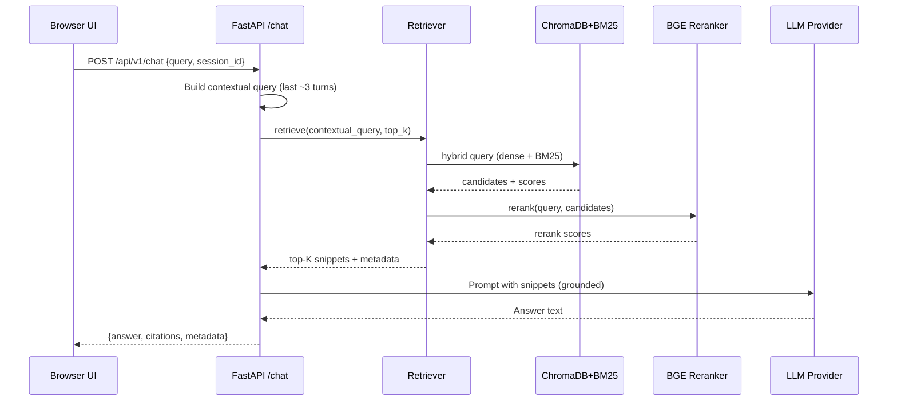

RegNavigator – Project Documentation

**Executive Summary**
- Purpose: Answer regulatory questions with grounded citations from your own PDF corpora (e.g., bills, statutes, guidance).
- Approach: Retrieval‑Augmented Generation (RAG) with hybrid retrieval (dense vectors + BM25), cross‑encoder reranking, and an LLM that answers strictly from retrieved snippets.
- Deliverables: FastAPI backend, Tailwind single‑page UI, ingestion pipeline, configurable providers (OpenAI/Anthropic), reproducible vector stores.

**System Architecture**
- Data ingestion: parse PDFs into overlapping text chunks, infer headers, compute embeddings, persist to ChromaDB (dense) and BM25 (sparse).
- Query serving: encode query, hybrid search (cosine + keyword), rerank with BGE cross‑encoder, prompt LLM with top snippets, return answer + citations.
- API and UI: FastAPI endpoints for chat and health; a minimal web client that displays answers and sources with page/jurisdiction.

**Data Flow**
- PDFs → pages → chunks → embeddings → stores → retrieval → reranking → answer + citations
- Chunking window: 600 chars with 100‑char overlap to improve recall around boundaries (`regnavigator/chunker.py:15`).
- Hybrid scoring: min‑max normalized dense similarity vs BM25 score with tunable weights (`regnavigator/store.py:171` and `regnavigator/config.py:15`).
- Final ranking: convex blend of hybrid score and normalized reranker score (`regnavigator/retriever.py:36`).

**Components (Code Map)**
- Chunking
  - `regnavigator/chunker.py:15` split_with_offsets: sliding window with overlap; preserves character offsets for citations.
  - `regnavigator/chunker.py:51` detect_header: heuristics for ARTICLE/SECTION, bill IDs (AB/SB), code sections.
- Loading
  - `regnavigator/loaders.py:7` find_pdf_files: discovers `data/<JURISDICTION>/pdfs/*.pdf`.
  - `regnavigator/loaders.py:20` load_pdf_pages: loads per‑page text via `PyPDFLoader`.
- Ingestion
  - `regnavigator/ingest.py:18` ingest_all: orchestrates pages → chunks → embeddings → stores; attaches page, header, offsets; IDs like `file.pdf|p12|34`.
- Embeddings
  - `regnavigator/embeddings.py:1` EmbeddingModel: defaults to E5 (`intfloat/e5-large-v2`) with “query:”/“passage:” prefixes; falls back to MiniLM if needed.
- Storage (Hybrid)
  - `regnavigator/store.py:21` VectorStore: ChromaDB for dense vectors, BM25 pickle index for keyword recall.
  - `regnavigator/store.py:97` query_hybrid: queries Chroma, looks up BM25 scores for same IDs, normalizes, blends by `MERGE_WEIGHT_*`.
  - `regnavigator/bm25_store.py:1` BM25Store: persists tokenized docs to `bm25_store/bm25_<jur>.pkl`.
- Reranking
  - `regnavigator/reranker.py:1` BGEReranker: cross‑encoder (`BAAI/bge-reranker-base`) scoring query‑passage relevance.
- Retrieval Orchestrator
  - `regnavigator/retriever.py:15` HybridRetriever.retrieve: encode query, expand top‑K from hybrid, rerank, select final K.
- LLM Orchestration
  - `regnavigator/llm.py:32` LLM.answer: formats a grounded prompt with numbered snippets; enforces “use snippets only” behavior.
  - `regnavigator/llm_providers.py:62` get_provider: returns OpenAI or Anthropic provider based on `.env`. Note: `LLM_PROVIDER=claude` resolves to Anthropic provider.
- API
  - `regnavigator/api.py:44` POST `/api/v1/chat`: multi‑turn chat with short in‑memory session history; returns `answer`, `citations`, and metadata.
  - `regnavigator/api.py:103` GET `/api/v1/health`: lightweight readiness check (retriever + LLM availability).
  - `main.py:39` mounts router, enables CORS and GZip, exposes `/` and `/health`.
- Frontend
  - `index.html:1` and `regnav-frontend/index.html:1`: Tailwind UI; calls `/api/v1/chat`, shows answer and sources, tracks a `session_id` for multi‑turn context.
- Diagnostics
  - `check_system.py:1` CLI checks for `.env`, deps, data presence, store population, and import‑readiness.

**Setup & Running**
- Prereqs: Python 3.10+, CUDA optional for reranker; network access to download models on first run.
- Install: `pip install -r requirements.txt`.
- Configure `.env` (examples):
  - `LLM_PROVIDER=openai` or `LLM_PROVIDER=anthropic` (or `claude` → Anthropic)
  - `OPENAI_API_KEY=...` and/or `ANTHROPIC_API_KEY=...`
  - Optional tuning: `MERGE_WEIGHT_DENSE`, `MERGE_WEIGHT_SPARSE`, `RERANK_WEIGHT`
- Prepare data: place PDFs under `data/CA/pdfs` (and other jurisdictions similarly).
- Ingest: `python -m regnavigator.ingest` (creates/updates `chroma_store/` and `bm25_store/`).
- Run API: `python main.py` (serves on `http://127.0.0.1:8000`).
- Use UI: open `index.html` (or `regnav-frontend/index.html`) in a browser; health indicator should show “API online”.

**API Contract**
- POST `/api/v1/chat` (`regnavigator/api.py:44`)
  - Request: `{ query: str, jurisdiction?: str = "CA", top_k?: int = 6, session_id?: str }`
  - Response: `{ answer: str, citations: [{ n, chunk_id, source_file, jurisdiction, page, header, char_start, char_end }], session_id, metadata }`
- GET `/api/v1/health` (`regnavigator/api.py:103`)
  - Response: `{ status: "ok" | "degraded", llm_available?: bool, error?: str }`

**Multi‑Turn Chat & Query Rewriting**
- Goals
  - Allow follow‑ups like “What about small businesses?” to inherit prior context (topic, bill, definitions) without the user repeating themselves.
  - Improve retrieval by turning context‑dependent utterances into standalone, unambiguous queries.

- Current behavior
  - Session memory: the backend keeps a short in‑memory history keyed by `session_id` (`regnavigator/api.py:17, 44, 47, 71-74`). The UI generates/persists a `session_id` in localStorage and sends it with each request (`index.html: API calls`).
  - Contextualization heuristic: on each turn, `_build_contextual_query` concatenates up to 6 recent user/assistant lines and prefixes them as lightweight “Context: … Current question: …” (`regnavigator/api.py:28-41, 52`). This gives the retriever more signal without changing the user’s question.
  - LLM grounding: the final answer uses only retrieved snippets and cites them (`regnavigator/llm.py:32-43`).

- Example
  - Turn 1: “What terms are prohibited under AB 489?” → standard retrieval.
  - Turn 2: “And what are the penalties?”
    - Rewriter output: “What penalties for violating prohibited terms under California AB 489?”
    - Retrieval uses rewritten query; answer cites specific pages/sections.

- Implementation hooks (where to add it)
  - Before `HybridRetriever.retrieve` in `regnavigator/api.py:54-57`, insert a rewriting call producing `standalone_query`. Use `standalone_query` for retrieval while keeping `req.query` for final prompt.
  - Optional: persist `summary` per `session_id` in `_sessions` or a simple in‑memory dict; rotate every few turns.

**Citations & Traceability**
- Each snippet retains page number, source filename, jurisdiction, header, and character offsets.
- The UI displays chunk numbers and file/page badges; backend returns machine‑readable citation arrays for auditing.

**Tuning & Performance**
- Chunk size/overlap: adjust in `regnavigator/chunker.py:4-6` to trade recall vs. index size.
- Hybrid weights: `MERGE_WEIGHT_DENSE` vs `MERGE_WEIGHT_SPARSE` in `.env` (`regnavigator/config.py:15-16`).
- Rerank weight: `RERANK_WEIGHT` controls final blend of hybrid vs reranker (`regnavigator/config.py:19-20`).
- Top‑K fanout: retriever expands to ~3× target before rerank (`regnavigator/retriever.py:21`).
- Hardware: reranker benefits from GPU; embeddings are precomputed.

**Troubleshooting**
- Run `python check_system.py` to validate env, deps, indexes, provider readiness.
- Empty answers: verify ingestion ran and `chroma_store/` + `bm25_store/` are populated; confirm `.env` keys and provider.
- Slow/expensive queries: lower `top_k`, reduce `RERANK_WEIGHT`, or use a lighter reranker model.
- Model download issues: ensure network access on first run; pre‑populate Hugging Face caches when air‑gapped.


**Key Files (Quick Links)**
- `regnavigator/api.py:44` chat endpoint
- `regnavigator/retriever.py:15` retrieval and reranking
- `regnavigator/store.py:97` hybrid query
- `regnavigator/chunker.py:15` chunking
- `regnavigator/llm.py:32` grounded prompting
- `main.py:39` router mounting and app setup
- `index.html:1` frontend client

**Architecture Diagrams (Mermaid)**

Flow – Query to Answer

```mermaid
flowchart LR
  A[User in UI<br/>index.html] -->|POST /api/v1/chat| B[FastAPI Router<br/>regnavigator/api.py]
  B --> C[_build_contextual_query<br/>short session history]
  C --> D{Rewrite?}
  D -- optional --> E[Standalone Query Rewriter]
  D -- else --> F[Original Query]
  E --> F
  F --> G[Embed Query (E5)
          regnavigator/embeddings.py]
  G --> H[Hybrid Retrieval
          VectorStore.query_hybrid]
  H -->|dense| I[ChromaDB<br/>cosine similarity]
  H -->|sparse| J[BM25 Index]
  I --> K[Score Merge
          MERGE_WEIGHT_*]
  J --> K
  K --> L[Cross‑Encoder Reranker
          BGE reranker]
  L --> M[Top‑K Snippets]
  M --> N[LLM Answer
          regnavigator/llm.py]
  N --> O[Answer + Citations]
  O --> P[UI Renders
          Sources Used]
```

Flow – Ingestion Pipeline

```mermaid
flowchart LR
  A[PDFs
    data/<JUR>/pdfs] --> B[Load pages
       PyPDFLoader]
  B --> C[Chunk pages
       600 chars, 100 overlap
       regnavigator/chunker.py]
  C --> D[Detect headers
       ARTICLE/SECTION/AB/SB]
  D --> E[Embed passages (E5)
       regnavigator/embeddings.py]
  E --> F[Store dense vectors
       ChromaDB]
  C --> G[Tokenize
       BM25]
  G --> H[Store sparse index
       bm25_store/*.pkl]
  F --> I[Ready for queries]
  H --> I
```

Sequence – Single Chat Turn


